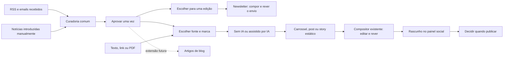

# Curadoria comum e conteúdos visuais — entrega local

Esta implementação parte do Hub existente, no repositório `fcarvalho007/social-media-n8n`, e preserva o compositor, a newsletter, as marcas e o painel de publicação. O código, os testes, a migração SQL e a pré-visualização foram preparados no computador. Nenhum prompt de implementação foi enviado ao Lovable nesta ronda.

## Fluxo editorial



A aprovação editorial é independente da escolha para uma newsletter. Aprovar uma notícia na curadoria não a envia nem a coloca automaticamente numa edição. A aprovação no fluxo antigo da newsletter também disponibiliza a fonte na curadoria comum. Reutilizar noutra edição cria uma seleção com ligação à fonte, sem mover notícias de edições anteriores.

Uma fonte escolhida para conteúdo visual fica congelada quando o trabalho é criado. Alterações posteriores não reescrevem o trabalho, e uma seleção desatualizada é recusada. A lista distingue artigo completo de título/resumo e identifica um excerto limitado quando a fonte ultrapassa 20 000 caracteres. Só são oferecidas fontes aprovadas; o servidor confirma esta decisão e o conteúdo real, sem confiar no texto enviado pelo navegador.

## O que está implementado

- Curadoria única: aprovar/rejeitar, pesquisa, tema, período, paginação, estado de reutilização e acesso à fonte.
- Seleção das notícias aprovadas nos dois editores de newsletter, Revista e Clássico.
- Fonte Curadoria no criador, a par de Texto, Link e PDF.
- Carrossel 1080×1350; post 1080×1350 com uma imagem; story estático 1080×1920 com uma imagem.
- Criação sem IA ou com o fluxo DeepSeek já existente, confirmação de pedidos pagos e limites por projeto.
- Mesmo editor, modelos visuais, imagens, pré-visualização e motor de renderização. As peças estáticas não permitem acrescentar páginas.
- PNG individual para post/story; PNGs e PDF para carrossel. A preparação social mantém versões, revisão e repetição segura de pedidos.
- Rascunho de post para Instagram/LinkedIn e de story para Instagram. A publicação continua no painel social, depois de revisão.
- Biblioteca «Conteúdos visuais» com identificação do formato e miniaturas nas dimensões corretas.

Blog e animação MP4 não foram acrescentados a este novo percurso. Os módulos e desenvolvimentos anteriores continuam no projeto. As fontes de curadoria mantêm o idioma original em modo sem IA; o modo assistido redige em português. A tradução dedicada da fonte curada não é oferecida: pode usar-se a opção Texto para preparar uma cópia traduzida.

## Pré-visualização sem Cloud

Na pasta do repositório:

```sh
npm ci
npm run dev:local
```

Abrir `http://127.0.0.1:5178/local-preview.html`.

Este modo usa notícias fictícias e guarda as decisões apenas na memória da página. Permite aprovar, escolher um formato, abrir o compositor real e descarregar um PNG de teste pelo menu Documento. Não inicia sessão, não consulta a base de produção, não chama IA e não publica. Recarregar reinicia os exemplos. A entrada e os adaptadores fictícios não fazem parte do build de produção.

`npm run dev` usa a configuração real do projeto; não é o modo isolado. Não colocar credenciais privadas no frontend nem nas fixtures.

## Verificação local

```sh
npm run typecheck
npx tsc --noEmit -p tsconfig.node.json
npm test -- --maxWorkers=2
npm run build
npm run check:edge
node_modules/.bin/deno check --config /tmp/deno-nl.json supabase/functions/mc-motor/index.ts
```

Os testes incluem uma instância PostgreSQL isolada em PGlite para executar a migração e os RPCs, com funções de autenticação e hash substituídas por fixtures determinísticas. Verificam autorização dos novos RPCs, fontes congeladas, conflitos, reutilização em edições, leases, exportações, destinos sociais e repetição de pedidos. Isto não substitui um teste de integração com as credenciais e os serviços de produção.

As capturas de modelos geradas pelos testes são escritas em `/tmp/hub-qa-modelos*`. O teste opcional de QA fotográfica só corre se existir a fixture externa `/tmp/foto.jpg`. O projeto mantém avisos herdados sobre o tamanho dos bundles; o build continua a compilar.

Os ficheiros `src/newsletter/**` são gerados. As integrações foram introduzidas em `scripts/port-newsletter.py`; repetir a geração deve produzir o mesmo cliente. Nunca alterar `migration-reference/`.

## Instalação final no Lovable

A sincronização GitHub não deve ser tratada como prova de que SQL e funções já foram instalados.

1. Comparar a branch `codex/curadoria-formatos-locais` com o `main` atual e preservar alterações entretanto feitas diretamente no Lovable. Resolver eventuais conflitos no computador.
2. No Cloud do Hub, confirmar que as migrações anteriores até `0038` estão aplicadas. Fazer um backup normal antes da alteração de esquema.
3. Aplicar **uma vez** `drizzle/migrations/0039_curadoria_unica_formatos.sql`, inteira e em transação, pelo mecanismo de migrações do projeto. É aditiva: cria a decisão editorial e a proveniência, adapta os RPCs de criação/exportação e preenche decisões a partir dos estados existentes. Não elimina conteúdos nem instala um cron.
4. Atualizar `mc-motor` com os módulos partilhados incluídos nesta branch. Publicar novamente os consumidores desses módulos que o mecanismo de deployment identificar; a verificação do grafo cobre os entrypoints `nl-*`.
5. Regenerar o catálogo de tipos Supabase a partir do esquema do Hub. Integrar o PR no `main` e confirmar que a pré-visualização Lovable recebeu o commit correto.
6. Testar no Hub: uma notícia aprovada; seleção numa newsletter de rascunho; um carrossel, um post e um story; guardar/voltar a abrir; exportar; preparar rascunho social duas vezes sem duplicar. Não enviar a newsletter nem publicar redes para validar esta instalação.
7. Publicar a aplicação pelo fluxo habitual apenas depois destes testes.

Caso haja um problema, voltar ao frontend/Edge da versão anterior. Manter a migração aditiva; não apagar colunas, fontes ou versões criadas. Diagnosticar o erro antes de novas alterações.

### Prompt de instalação preparado

Usar depois de integrar a branch no GitHub e de verificar que a pré-visualização do Lovable está no commit certo:

> O código de curadoria única e formatos visuais já está implementado e testado localmente. Segue `docs/curadoria-local-e-instalacao.md`. Não redesenvolvas a interface nem o compositor. Confirma as migrações anteriores e aplica uma vez a migração `0039_curadoria_unica_formatos.sql` no Cloud deste Hub. Atualiza a Edge Function `mc-motor` e os seus módulos partilhados; verifica os consumidores afectados. Regenera os tipos da base. Valida leitura/decisão/seleção da curadoria e a preparação de rascunhos para carrossel, post e story, sem enviar newsletter nem publicar conteúdos. Preserva a entrada por email, marcas, papéis existentes, integrações, históricos e os meus desenvolvimentos anteriores. Não atives automações, não recries o projeto e não publiques a aplicação ainda. Apresenta os resultados concretos e qualquer requisito externo que falte.

## Integrações externas

Esta ronda local não confirma receção real do CloudMailin, credenciais WordPress, listas E-goi ou publicação GetLate. Esses serviços conservam a configuração atual. A curadoria passa a reutilizar as notícias já recolhidas, mas não resolve uma fonte que não recebe dados por falta de credenciais ou configuração externa.

A validação final deve usar eventos reais e registos: receção de um email de teste pelo CloudMailin; uma recolha RSS; leitura de listas E-goi; ligação WordPress; contas sociais disponíveis. Um secret presente, isoladamente, não prova que a integração funciona. Os pedidos IA e o funcionamento do Cloud continuam a ter custos próprios depois da instalação; desenvolver o código localmente evita prompts Build no Lovable.
